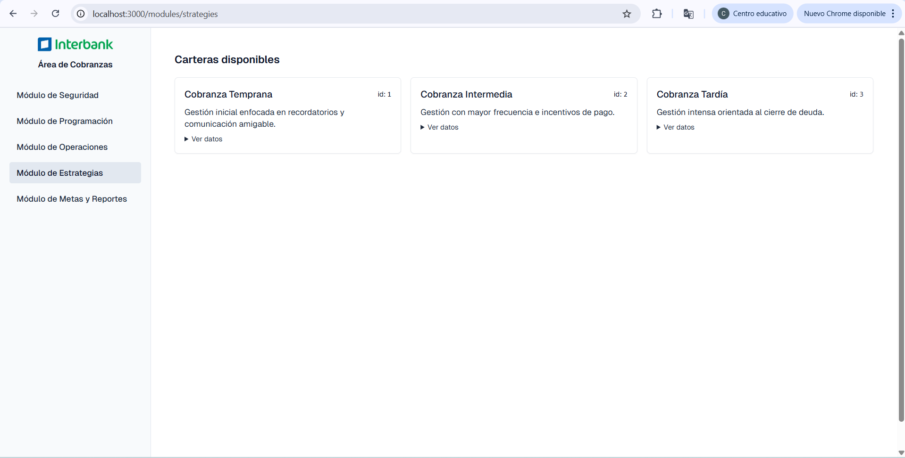
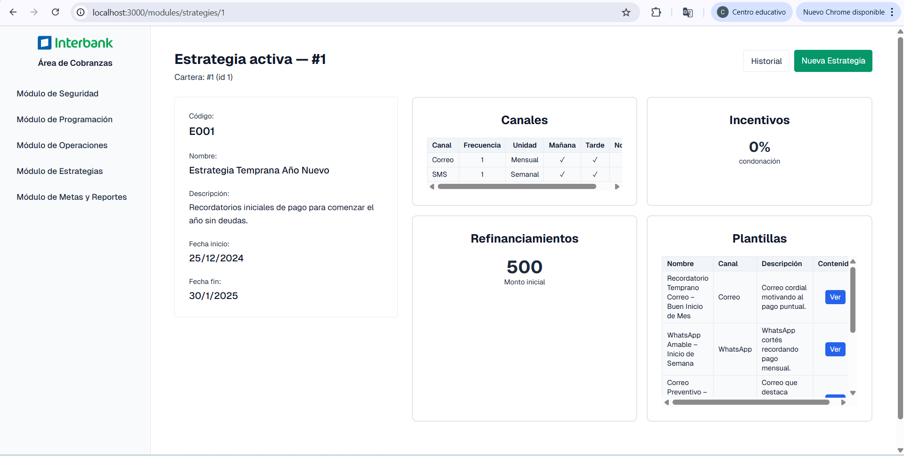
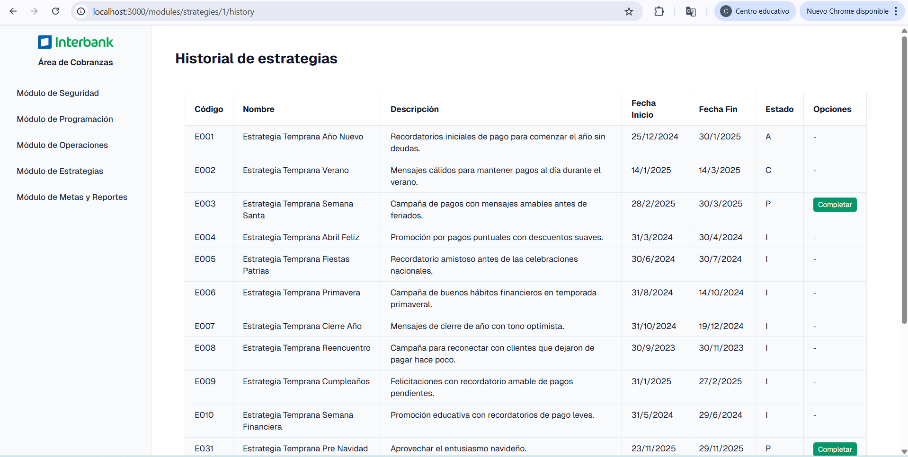
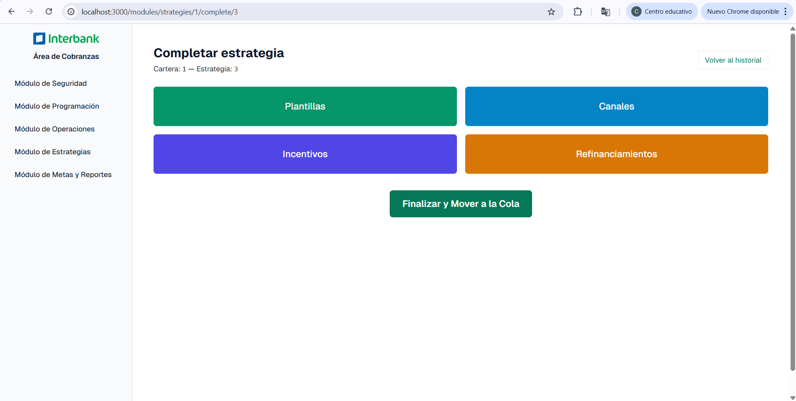
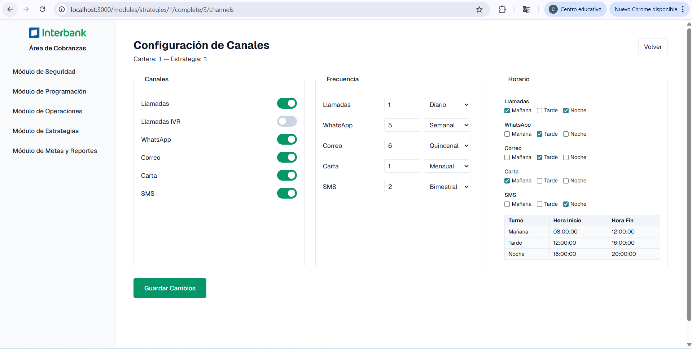
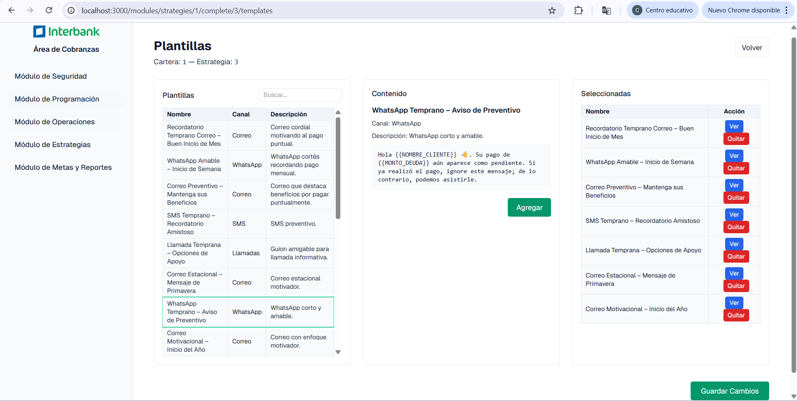
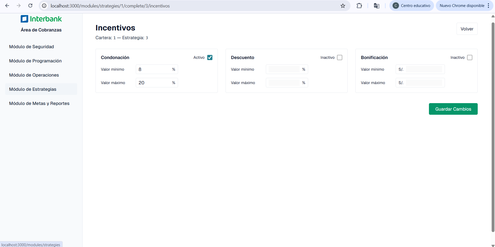
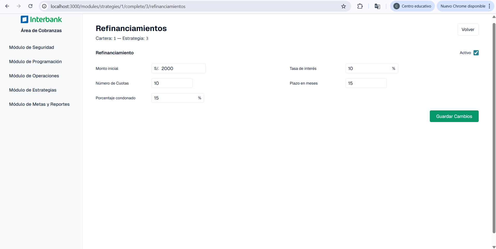

# Sistema de Cobranzas — Módulo de Estrategias

Este documento describe de forma detallada las opciones implementadas en el Módulo de Estrategias del Sistema de Cobranzas, con una narrativa funcional y puntos de referencia visuales. Incluye flujos de trabajo, pantallas, acciones disponibles y consideraciones técnicas relevantes.

## Índice
- Historia de Estrategias
- Vista de Estrategia (Resumen)
- Completar Estrategia
  - Canales
  - Plantillas
  - Incentivos
  - Refinanciamientos
  - Finalizar y mover a la cola
- Consideraciones Técnicas (Supabase/Next.js)
- Errores comunes y solución

---

## Vista de Estrategia (Resumen)
Ruta: `/modules/strategies/[id]`

- Descripción: Resumen con 4 recuadros (Canales, Plantillas, Incentivos, Refinanciamientos) y datos clave.
- Técnicas UI: App Router con Suspense para cargas; componentes cliente para interacción.

Narrativa:
1. El usuario confirma configuración general y accede a cada sección para completar detalles.

---

## Historia de Estrategias
Ruta: `/modules/strategies/[id]/history`

- Descripción: Lista todas las estrategias de una cartera (id) ordenadas por el campo `Código`.
- Controles:
  - Botón `Nueva Estrategia`: inicia el flujo de creación.
  - Botón `Volver`: regresa al índice del módulo de estrategias.
- Tabla:
  - Columnas: Código, Nombre, Descripción, Fecha Inicio, Fecha Fin, Estado, Opciones.
  - Orden: por `Código` ascendente. Se realiza en consulta y se asegura con ordenamiento cliente.

Narrativa:
1. El usuario ingresa el id de la cartera; se cargan las estrategias asociadas.
2. Visualiza el estado, fechas y puede navegar a completar una existente.

---

## Completar Estrategia
Ruta contenedora: `/modules/strategies/[id]/complete/[strategyId]`

Pantalla principal con 4 botones grandes:
- Plantillas
- Canales
- Incentivos
- Refinanciamientos

Además: Botón destacado `Finalizar y Mover a la Cola` que cambia el estado de la estrategia (de `P` a `C`) y redirige al historial.

### Canales
Ruta: `/complete/[strategyId]/channels`

- Función: Configurar canales de cobranza con frecuencia/unidad y turnos (mañana/tarde/noche).
- Datos: Se obtienen por RPCs (`lista_canales`, `lista_frecuencias`, `lista_turnos`). Guardado vía `guardar_config_canales`.
- UI: Tabla y controles con inputs claros (modo claro forzado).

Acciones:
- Seleccionar canal.
- Definir frecuencia y su tipo.
- Activar turnos.
- Guardar (bulk upsert a `detalle_estrategia`).

Narrativa:
1. El usuario activa canales relevantes para la estrategia.
2. Define frecuencia/unidad y turnos; guarda la configuración.

### Plantillas
Ruta: `/complete/[strategyId]/templates`

- Función: Seleccionar plantillas filtradas por cartera y los canales ya configurados.
- Lista izquierda: Tabla con Nombre, Canal, Descripción y búsqueda.
- Panel central: Vista de contenido (con botón `Agregar`).
- Lista derecha: Seleccionadas con acciones `Ver` y `Quitar`.
- Guardado: Botón `Guardar Cambios` que llama `guardar_plantillas_estrategia` (inserta en `estrategia_plantilla`, ignora duplicados).

Narrativa:
1. El usuario busca y previsualiza el contenido.
2. Agrega a la lista; guarda cambios a la estrategia.

### Incentivos
Ruta: `/complete/[strategyId]/incentivos`

- Secciones verticales: `Condonación`, `Descuento`, `Bonificación`.
- Switch por sección para activar/inactivar.
- Inputs:
  - Condonación/Descuento: `Valor mínimo` y `Valor máximo` con `%` fijo a la derecha.
  - Bonificación: `Valor mínimo` y `Valor máximo` con `S/.` fijo a la izquierda.
- Guardado: Botón `Guardar Cambios` que llama `guardar_incentivos_estrategia` e inserta en `catalogo_incentivo`.

Narrativa:
1. El usuario activa las secciones que requiere.
2. Define rangos y guarda; cada sección se inserta con nombre estricto.

### Refinanciamientos
Ruta: `/complete/[strategyId]/refinanciamientos`

- Switch para activar.
- Formulario con:
  - Monto inicial (con `S/.` a la izquierda)
  - Tasa de interés (`%` a la derecha)
  - Número de Cuotas
  - Plazo en meses
  - Porcentaje condonado (`%` a la derecha)
- Guardado: Botón `Guardar Cambios` que llama `guardar_refinanciamiento_estrategia` e inserta en `catalogo_refinanciamiento`.

Narrativa:
1. El usuario activa el refinanciamiento.
2. Completa los campos; guarda la configuración.

### Finalizar y Mover a la Cola
- Botón al pie de la página principal de completar.
- Acción: Cambia `id_estado_estrategia` de `P` a `C` vía RPC `finalizar_estrategia`.
- Redirección: Historial de estrategias de la cartera.

---

## Consideraciones Técnicas
- Tecnología: Next.js (App Router), React, TypeScript, Tailwind.
- Supabase: Uso de RPCs `SECURITY DEFINER` con `search_path` fijado para evitar problemas de esquemas y RLS.
- Principios:
  - Lecturas/escrituras mediante `supabase.rpc(...)`.
  - Componentes cliente para interactividad (onClick, manejo de estado).
  - Suspense en páginas con server components que requieren `cookies()`.

RPCs clave:
- `lista_canales`, `lista_frecuencias`, `lista_turnos`
- `guardar_config_canales`
- `obtener_detalle_estrategia`
- `obtener_plantillas_filtradas`, `obtener_plantillas_seleccionadas`, `guardar_plantillas_estrategia`
- `guardar_incentivos_estrategia`
- `guardar_refinanciamiento_estrategia`
- `finalizar_estrategia`

---

## Errores Comunes y Solución
- Error de “Uncached data accessed outside of <Suspense>”: Usar `<Suspense>` y separar lógica async en componentes hijos.
- Problemas de `search_path`/RLS: Evitar selects directos; usar RPCs `SECURITY DEFINER`.
- Event handlers en server components: Mover interacción a componentes cliente.

---
